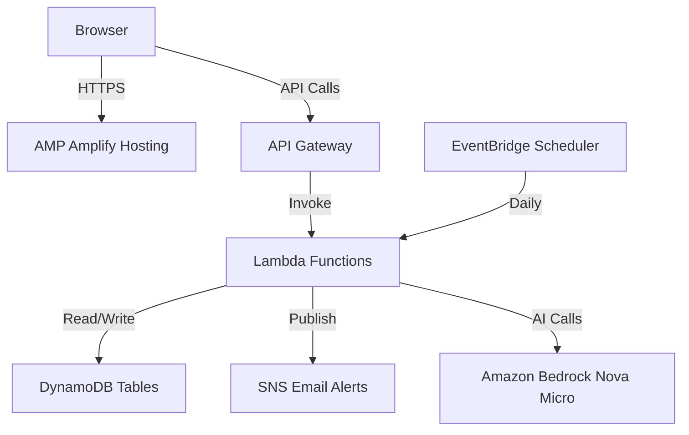

# Architecture Diagram

```mermaid
flowchart TD
    Browser -->|HTTPS| Amplify[AMP Amplify Hosting]
    Browser -->|API Calls| API[API Gateway]
    API -->|Invoke| Lambda[Lambda Functions]
    Lambda -->|Read/Write| DynamoDB[DynamoDB Tables]
    Lambda -->|Publish| SNS[SNS Email Alerts]
    Lambda -->|AI Calls| Bedrock[Amazon Bedrock Nova Micro]
    EventBridge[EventBridge Scheduler] -->|Daily| Lambda
```

*See the full diagram in `docs/architecture.md`.*
